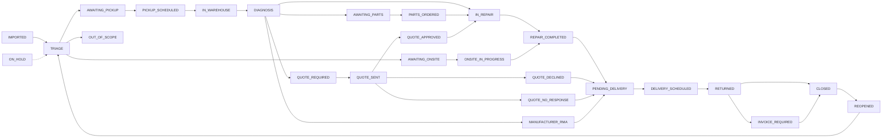

# BreakFix Triage

Operations platform for the NYC DOE device break-fix lifecycle. Replaces a
legacy Google Sheets + Apps Script workflow with a proper database-backed
application.

## What this is

BreakFix Triage tracks devices and tickets from ServiceNow intake through
scheduling, pickup, warehouse diagnosis, repair, quoting, delivery, and
closure. It is designed to scale across districts and to replace a brittle
spreadsheet-based operational workflow with:

- a **relational, auditable data model** (PostgreSQL + Prisma)
- a **state-machine-driven ticket lifecycle** (not "move a row between tabs")
- a **CSV/XLSX import pipeline** with validation, duplicate detection, and
  a reviewable conflict queue
- a **scheduling and dispatch model** with pluggable route optimization
- **role-based access control** and an **append-only audit log**
- a **Next.js 14** web UI for operations staff

See `docs/ARCHITECTURE.md`, `docs/DOMAIN.md`, `docs/MIGRATION_PLAN.md`, and
`docs/ASSUMPTIONS.md` for the full design. Maps, photo proof, and
signature capture (what's zero-config vs optional) are documented in
`docs/maps-and-field-capture.md`.

## Round-21 field-ops usability review (June 2026)

Root-caused the "every button does nothing" class to the CSP
(dev-mode hydration death + map tiles blocked in all modes), fixed a
credential-leaking sign-in fallback, made bulk transitions
selection-aware with confirmation and sticky error feedback, gave
signatures attributable signer metadata, required reasons on failed
stops, and repaired several fake affordances (SLA-breached deep
link, pagination dropping filters, feedback eaten by the cuid
redirect). Full detail in `docs/round-21-summary.md`; maps/photo/
signature setup in `docs/maps-and-field-capture.md`.

## Round-14 live-runtime review (June 2026)

The first full review run against a live runtime (Postgres +
production build + Playwright). Re-activated the e2e suite (every
spec had been blanket-`fixme`'d), fixed the authorization layer
(`requireRole` now redirects to a chromed `/forbidden` page —
ADR 0017), graduated `/scheduling/routes` to a real index page,
added a root-level branded 404, made the bench "Pick up"
affordance actually reachable by technicians, and implemented the
state-machine + import-dedupe integration tests that had been
`it.todo` stubs since Round 11. Full detail in
`docs/round-14-summary.md`; verification protocol in
`docs/round-14-qa-checklist.md`.

## Migration audit (May 2026)

A two-pass audit landed on `claude/breakfix-triage-audit-ZDYuJ`.

**Pass 1 — migration audit.** Produced:
- `docs/architecture-map.md` — concrete map of where everything is
  (route table, jobs, integrations, hot-spots), complementing
  `ARCHITECTURE.md`.
- `docs/legacy-parity.md` — Google Sheet ↔ web-app parity table.
- `docs/proposed-issues.md` — gap-closures and feature proposals
  needing maintainer sign-off.
- `docs/adr/0001..0004-*.md` — ADRs for the migration mapping, the
  canonical aging convention, the hold-window minimum, and the
  APPROVED-quote sweep funnel.
- `qa/persona-runs/SUMMARY.md` — per-role static-walkthrough
  findings + Playwright skeleton.

**Pass 2 — findings-driven bugfix and UX hardening.** A field QA
pass against `https://triage.omnia-house.com` produced 9 confirmed
bugs (A1–A9), 5 workflow concerns (B1–B5), per-page UX issues, and
theme/polish issues. Fixed in this branch (one commit per concern,
all green in CI):

| Finding | Summary                                                    | Where                                                                                          |
| ------- | ---------------------------------------------------------- | ---------------------------------------------------------------------------------------------- |
| A1      | Dashboard tab nav drops on /dashboards/*                   | `src/app/(app)/dashboards/layout.tsx`, `src/components/dashboard-tabs.tsx`                     |
| A2      | Audit-log JSON drops the reason; no transitionType column  | `src/lib/audit/audit.ts`, `src/lib/workflow/transition.ts`, ADR `0006-audit-row-includes-reason.md` |
| A3      | Raw Prisma errors leak in import summary                   | `src/lib/import/error-translate.ts`, `src/lib/import/pipeline.ts`                              |
| A4 + A5 | Topbar dropdowns don't close; search becomes unclickable   | `src/components/popover-menu.tsx`, `notification-bell.tsx`, `help-menu.tsx`                    |
| A6      | Force-change holds residual state after submit             | `src/components/force-change-form.tsx`, `src/server/actions/tickets.ts`                        |
| A7      | Comment delete is permanent with no confirmation           | `src/components/comment-delete-button.tsx`, `comment-thread.tsx`                               |
| A8      | "SUMMARY ↓" header sorts by `reportedAt`                   | `src/app/(app)/tickets/page.tsx`                                                               |
| A9      | `/admin/audit` 404s                                        | `src/app/(app)/admin/audit/page.tsx`, `src/app/(app)/audit/page.tsx`, `admin-sidebar.tsx`      |
| B2 / D  | AWAITING_* color collision; `ALL_CAPS_SNAKE_CASE` pills    | `src/components/state-pill.tsx`, `src/lib/cn.ts::humaniseEnum`, `src/components/sla-badge.tsx` |
| §2#2    | IMPORTED hidden from Kanban (248/252 tickets invisible)    | `src/app/(app)/tickets/kanban/page.tsx`                                                        |
| §6 list | Priority + Reported columns on Tickets list; sortable      | `src/app/(app)/tickets/page.tsx`, `src/components/priority-pill.tsx`                           |
| §6 day  | KPI tiles clickable + reconcile metric definitions         | `src/app/(app)/page.tsx`                                                                       |
| §4      | 16-state taxonomy proposal + ON_HOLD overlay (Stage 1 ADR) | `docs/adr/0005-status-taxonomy-simplification.md` — **gated on maintainer sign-off**            |

Pass 1 also closed the four bugs from the original migration brief
(`§4` of the migration task): bench bucketing, APPROVED-quote sweep,
aging off-by-one, and quote default hold-window. Those land on the
same branch.

**Conventions enforced going forward:** `docs/ui-conventions.md`
captures the toast policy, pill casing, dash style, empty-state
convention, and the forbidden-token list (Prisma stack tokens
never leak to user-facing surfaces — pinned by
`tests/forbidden-tokens.test.ts`).

## Personas (RBAC matrix at a glance)

7 roles, expanded in `src/lib/auth/rbac.ts`:

| Role         | Default permission focus                                    |
| ------------ | ----------------------------------------------------------- |
| ADMIN        | Everything; can `force` transitions; admin pages.           |
| OPS_MANAGER  | Read + write + transition + scheduling + quotes write.      |
| DISPATCHER   | Read + transition + scheduling/routes/stops.                |
| WAREHOUSE    | Read + transition. Primary tool: `/scan/warehouse`.         |
| TECHNICIAN   | Read + transition. Primary tool: `/bench?scope=me`.         |
| DRIVER       | Tickets read + scheduling read + stops update.              |
| READ_ONLY    | Read-only across tickets / imports / scheduling / quotes.   |

Login as the seeded persona for any role: `<role>@breakfix.local` /
`breakfix-dev`. Per-role permission overrides are persisted in
`AppSetting` and editable at `/admin/permissions`.

## Ticket state machine (high-level)

26 states. The full transition table is `src/lib/workflow/states.ts`.



`ON_HOLD` is reachable from every non-terminal state and resumes via
`payload.resumeState`. Force changes (`force: true`) bypass the edge
check and are gated to ADMIN; every force still writes a TicketEvent
plus an AuditLog row.

## Status

**Phase 0 — Foundations** ✓ complete.
**Phase 1 — Auth, UI shell, read-only parity** ✓ complete.
**Phase 2 — Scheduling & dispatch** ✓ complete.
**Phase 3 — Quotes, OOW, invoices, hold-window automation** ✓ complete.
**Phase 4 — Email, Google Routes, ServiceNow API** ✓ complete.
**Phase 5 — Cutover tooling and runbook** ✓ complete.
**Phase 6 — Adoption (admin UIs, comments, attachments, SLAs, search, profile)** ✓ complete.
**Phase 7 — Workflow (bulk, kanban, bench, loaners, escalation, digest, settings)** ✓ complete.
**Phase 8 — Business features (parts, RMA, finance, portal, KB, calendar, shift notes)** ✓ complete.
**Phase 9 — Polish & platform (QR scan, shortcuts, a11y, health, rate-limit, CSP)** ✓ complete.
**Phase 10 — Refinement (home, toasts, time tracking, templates, merge, signatures, map links, PWA, productivity, hotspots, bulk close)** ✓ complete.
**Phase 11 — Final polish (2FA, drag-drop kanban, SSE live updates, dark/light, onboarding tour, sortable columns, form preservation)** ✓ complete in this commit.

All migration-plan phases plus Phase 6–11 are shipped. See
`docs/CUTOVER_PLAN.md` for the operational cutover runbook.

- Full Prisma schema covering tickets, devices, schools, districts, jobs,
  routes, quotes, imports, duplicates, audit, and notifications
- Ticket state machine with transition guards, event log, and audit writes
- CSV/XLSX ingestion pipeline that maps ServiceNow headers, validates rows
  with Zod, upserts tickets, and detects duplicates
- Duplicate conflict resolution engine tied to the state machine
- Nearest-neighbor route optimizer behind a swappable interface
- RBAC matrix for seven roles
- Next.js skeleton pages for tickets, imports, duplicates, scheduling,
  and dashboards
- Vitest coverage for state machine, mapper/schema, optimizer, and RBAC
- Deterministic seed data (two districts, four schools, three tickets)

**Added in Phase 1:**

- NextAuth credentials provider (bcrypt against the User table) and optional
  Google Workspace OIDC
- Sign-in page, route groups `(auth)` and `(app)`, middleware-based auth
- Session helpers: `getSession()`, `requireSession()`, `requireRole()`
- Authenticated layout shell with nav and sign-out
- Ticket list with filter, search, pagination
- Ticket detail with event timeline and in-UI state transitions (via
  server actions that go through the state machine)
- Import upload UI that runs the full pipeline and shows per-row outcomes
- Duplicate resolution UI with five resolution strategies
- Dashboards wired to real queries (open by state, closed-by-month bars,
  aging table, duplicate + invoice queues)

**Added in Phase 2:**

- Scheduling dashboard grouping pickup-ready / delivery-ready / onsite-ready
  tickets by school with one-click "create job" forms
- Route builder page: multi-select unscheduled jobs, pick date + driver +
  vehicle, and the optimizer sequences the stops
- Route detail page with per-stop status controls (Start / Arrived /
  Complete / Fail), manual up/down reorder while the route is still open,
  and a Cancel Route action that reverts the underlying tickets
- `/my-day` driver view — mobile-friendly one-tap status updates over
  the signed-in user's active routes
- `updateStopStatus` service that cascades stop completions into ticket
  transitions (PICKUP_SCHEDULED → IN_WAREHOUSE, DELIVERY_SCHEDULED →
  RETURNED) and rolls the parent route forward to IN_PROGRESS / COMPLETED
- `reorderRoute` / `cancelRoute` services with audit entries
- New `stops:update` permission with DRIVER, DISPATCHER, OPS_MANAGER and
  ADMIN on the allow list; vitest coverage for the pure stop-status
  validator

**Added in Phase 3:**

- Quote lifecycle services (`createQuote`, `updateDraftQuote`,
  `sendQuote`, `respondToQuote`, `cancelQuote`) with activity logs and
  full audit trail; quote state transitions cascade into the ticket
  state machine through the existing `quoteStateAlignment` guard
- `/quotes` queue page with per-status tabs, a banner for overdue
  sent quotes, and a "Run hold-window sweep" button that triggers the
  same sweeper as the scheduled job
- Hold-window automation: `sweepExpiredQuotes` flips every overdue
  SENT quote to NO_RESPONSE and moves the owning ticket to
  QUOTE_NO_RESPONSE. Exposed both as a server action (manual trigger)
  and as a standalone `npm run quotes:sweep` script for cron
- Purchase order / invoice services: `attachPurchaseOrder` upserts a
  PO against an APPROVED quote; `markPoInvoiced` stamps `invoicedAt`
  and optionally transitions INVOICE_REQUIRED → CLOSED through the
  `invoiceBeforeClose` guard
- `/invoices` queue page listing every INVOICE_REQUIRED ticket with
  an inline PO entry form and a "Mark invoiced + close" action
- Ticket detail page now shows quote activity history and contextual
  DRAFT/SENT action buttons (Send / Approve / Decline / Cancel) plus
  an inline "Create quote" form when the ticket is in QUOTE_REQUIRED
- New vitest coverage for `isQuoteExpired` including edge cases
  (no hold window, boundary equality, non-SENT statuses)

**Added in Phase 4:**

- SMTP notification transport built on nodemailer, compatible with
  Google Workspace SMTP relay, Gmail app passwords, SES, SendGrid, or
  any other RFC-compliant server. Selected by `NOTIFICATION_TRANSPORT=
  smtp` (or auto-detected whenever the `SMTP_*` env vars are
  populated), with graceful fallback to the stdout transport.
- Pure-function notification templates for quote-sent, delivery-
  scheduled, pickup-scheduled, and quote-no-response, all plain text
  so they work across stdout, SMTP, and any future webhook transport.
- `enqueueNotification` helper that writes a PENDING Notification row
  and (outside a transaction) fires the dispatch in the background,
  recording success or failure back onto the row.
- Live notifications wired into `sendQuote`, `buildRoute`, and
  `sweepExpiredQuotes`, each routed to the school's primary contact.
- Google Routes optimizer with `buildComputeRoutesBody` and
  `parseComputeRoutesResponse` exposed as pure functions for unit
  testing; selected by `ROUTE_OPTIMIZER=google-routes` with a
  populated `GOOGLE_ROUTES_API_KEY`. Fails open to the built-in
  nearest-neighbor optimizer if the key is missing.
- ServiceNow API connector: `normalizeServiceNowRow` (pure mapper),
  `fetchServiceNowIncidents` (Table API wrapper with basic auth), and
  `runServiceNowSync` (runs the records through the existing commit
  pipeline and writes a real `ImportBatch`).
- Manual "Sync from ServiceNow" button on `/imports/new` gated on
  `SERVICENOW_*` env vars, plus a standalone
  `npm run servicenow:sync` script for cron / Unraid User Scripts.
- New vitest coverage: notification templates (8 cases), Google
  Routes response parser + body builder (7 cases), ServiceNow row
  normalizer (6 cases).

**Added in Phase 10 — Refinement release:**

The "make every daily workflow feel good" phase. A gap audit found
eleven friction points I'd kept deferring, and this commit closes
all of them.

- **Attention-driven home page**: action blocks instead of generic
  KPIs. Every user sees their own queue, unread notifications,
  recent shift notes, and a running-timer banner if they have one.
  Dispatchers/ops managers additionally get a manager attention
  queue (SLA-breached / duplicates / expired quotes / invoices
  pending / unscheduled jobs) and the ten oldest breached tickets.
- **Toast notifications**: client `ToastHost` strips `?ok` and
  `?error` params from the URL on navigation and pops a
  fixed-position toast. Replaces the "redirect + banner that stays
  in history" hack with a native feel, no dependencies.
- **Time tracking** on tickets:
  - New `TimeEntry` model with signed minutes
  - `startTimer` / `stopTimer` with auto-stop of any previous open
    timer for the same user (so clocking in on a new ticket
    cleanly clocks out the old one)
  - Ticket detail page shows total time, per-entry log, and a
    context-aware Start / Stop form
  - Home page shows a running-timer banner if any timer is open
- **Ticket templates**:
  - New `TicketTemplate` model with name, short/long description,
    priority
  - `/admin/templates` admin page to create and toggle templates
  - Quick-create form at the top of the ticket list spins up a new
    ticket in one click (pick template + school + optional
    device serial)
  - Generated incidents use a `LOCAL<base36>` prefix so they don't
    collide with ServiceNow `INCxxxxx`
- **Ticket merge** beyond the duplicate queue:
  - Soft merge: source gets `mergedIntoTicketId`, state → CLOSED,
    both tickets get explanatory comments
  - Viewing a merged source auto-redirects to the target with a
    toast
  - "Merge ticket" card on the detail page accepts a target
    incident number for one-click merging
- **E-signature capture**:
  - New `SignaturePad` client component using pointer events
    (finger, stylus, mouse — same API), DPR-aware canvas sizing,
    clear button
  - Writes a base64 PNG to a hidden input, submitted via the
    existing `uploadAttachmentAction`
  - Wired onto every route-stop card so school contacts can sign
    for pickups and deliveries
- **Map links on stop addresses**: tapping an address on
  `/my-day` opens Google Maps (uses lat/lng when available,
  falls back to a text search). One-tap navigation for drivers.
- **Warehouse scan-in flow** (`/scan/warehouse`):
  - Dedicated scanner page for the warehouse intake bench
  - Each scan auto-transitions every `AWAITING_PICKUP` /
    `PICKUP_SCHEDULED` ticket for the device to `IN_WAREHOUSE`
  - Skips tickets that would fail the state machine guard;
    reports the count of moves and skips via a toast
- **Productivity dashboard** (`/dashboards/productivity`):
  - Per-assignee: tickets closed in window, average turnaround
    (reported → closed), open assigned, hours logged
  - Rolling window selector (7 / 14 / 30 / 60 / 90 days)
  - Totals across the board for spot-check managers
- **Device hotspots dashboard** (`/dashboards/devices`):
  - Devices with N+ tickets in a rolling window
  - Configurable threshold (default: 3 tickets in 180 days)
  - Sorted hottest-first so retire-or-repair candidates surface
- **Bulk close stale** admin action on `/admin/settings`:
  - Picks a state + day threshold, closes every ticket older than
    that through the state machine
  - Confirm dialog before firing
- **PWA manifest** at `/public/manifest.webmanifest`:
  - Standalone display, theme color, shortcuts to My Day / Scan /
    Tickets
  - Root layout now advertises the manifest, viewport, and
    Apple web-app meta tags
- **Schema**: new `TimeEntry`, `TicketTemplate`, and
  `mergedIntoTicketId` column on Ticket (self-relation).

New tests (164/164 passing, +4 new):
- `tests/time-tracking.test.ts` — 4 cases for `computeMinutes`
  (rounding, zero, negative clamp, multi-hour)

Deferred at the time — all shipped in Phase 11.

**Added in Phase 11 — Final polish release:**

The gap-list from the end of Phase 10 was short but sharp. This
phase takes the remaining "nice-to-have, never scheduled" items and
ships them together so the app can be called done.

- **Two-factor authentication** (TOTP + recovery codes):
  - New `totpSecret`, `totpEnabledAt`, and `backupCodes` columns on
    `User`
  - `src/lib/auth/totp.ts` wraps `otplib` with a ±1 time-step drift
    tolerance, human-friendly recovery codes (4 groups of 4 base32
    chars, avoiding 0/O/1/I), and SHA-256-hashed storage (recovery
    codes are high-entropy so slow hashing would only create a login
    DOS vector)
  - Setup flow at `/profile/2fa`: server-rendered QR code, a pending
    secret stashed in an httpOnly cookie so an abandoned enrollment
    never half-configures an account, one-shot recovery-code display
    after confirmation
  - Sign-in page reads a `totpCode` field (accepts either a fresh
    6-digit code or a recovery code); recovery codes are consumed
    single-use and the list shrinks by one on each use
  - Admin emergency reset action wipes 2FA on a user if a phone is
    lost and all recovery codes are gone
- **Drag-and-drop kanban** (`/tickets/kanban`):
  - Pure HTML5 drag-and-drop — no dependencies added
  - Optimistic UI: the card moves the instant it lands in a column,
    then reverts if the server rejects the transition
  - New `POST /api/tickets/:id/transition` JSON endpoint used by the
    client (server actions can't double as fetch targets for
    client-side JS, so a thin route is the cleanest wrap)
  - Goes through the existing state machine, guards, audit log, and
    SSE publish — dragging to an illegal column surfaces the
    transition error inline
- **Real-time SSE updates**:
  - Tiny in-process event bus (`src/lib/events/bus.ts`) on a
    `globalThis`-stashed `EventEmitter` so HMR in dev mode doesn't
    fork into two instances
  - `GET /api/events` opens a `text/event-stream` subscription,
    15-second heartbeat comments to beat idle-kill proxies, auth-gated
    so anonymous bots can't open long-lived connections
  - `src/components/use-app-events.ts` client hook subscribes via
    `EventSource`, debounces bursts into a single `router.refresh()`
  - `AutoRefresh` component now runs SSE always-on with the polling
    checkbox kept as an explicit fallback
  - Kanban board subscribes directly so teammates see each other's
    drags live
  - `transitionTicket` publishes a `tickets.changed` event after
    commit (only on the outer-transaction path — in-progress
    transactions emit when their owner finishes)
  - Bulk transition / bulk assign additionally emit a coarse
    `tickets.bulk-changed` event for one-shot refreshes
- **Dark / light toggle**:
  - Tailwind switched to `darkMode: "class"` with all palette colors
    defined as CSS custom properties in `globals.css`
  - `ThemeToggle` client component writes a 180-day cookie and
    swaps the class on `<html>`
  - Root layout reads the cookie server-side so the class is stamped
    before hydration — no flash of wrong theme
  - Light mode avoids a 60-file refactor by mapping the legacy
    `text-slate-*` classes to inverted colors under `:root.light`.
    Pragmatic but readable
  - Honors `prefers-reduced-motion: reduce` to disable app-wide
    transitions for users who've asked
- **Onboarding tour** (`src/components/onboarding-tour.tsx`):
  - First-visit modal walkthrough on the home page
  - Cookie-backed `bft_onboarding_done` dismissal so clearing
    cookies re-triggers the tour (matches demo expectations)
  - Step content is role-specific: ADMIN, OPS_MANAGER, DISPATCHER,
    TECHNICIAN, WAREHOUSE, DRIVER, READ_ONLY each get their own
    3–4-step tour pointing at the pages they'll actually use
  - Does not anchor overlays to specific DOM elements — centered
    modal with Next/Back/Skip so layout changes don't break the tour
- **Sortable ticket list columns**:
  - Column headers on `/tickets` are links that toggle
    `?sort=<key>&dir=<asc|desc>` for `reportedAt`, `state`,
    `priority`, `incidentNumber`, and `stateEnteredAt`
  - `↑` / `↓` indicators on the active column
  - Sort params thread through to the `BulkActionForm` so bulk
    operations return the user to the same sort
- **Form input preservation** (`src/lib/forms/preserve.ts`):
  - Server actions that redirect with `?error=...` on validation
    failure now additionally encode the submitted `FormData` into a
    base64url JSON `?form=` parameter
  - Page components read the param, decode it, and pass values to
    their form inputs as `defaultValue`
  - Explicit `allow` list filters out password / secret fields so
    they never bounce through the URL
  - Wired onto the `create user` and `create school` flows as the
    representative multi-field forms most vulnerable to the problem
- **ARIA pass**:
  - Notification bell summary now has `aria-label="Notifications, N
    unread"` and the emoji + badge are `aria-hidden`
  - (Prior phases already covered most icon buttons; this pass
    confirms the remaining ones and labels them)

New tests (194/194 passing, +30 new):
- `tests/totp.test.ts` — 14 cases for secret generation, code
  verification (including drift, malformed, stripped non-digits),
  recovery code generation (uniqueness, shape, ambiguous-char
  exclusion), and consumption (match, no-match, normalization,
  single-use replay prevention)
- `tests/form-preserve.test.ts` — 12 cases for encode/decode
  round-trips, multi-value fields, allow-list filtering, malformed
  input handling, and redirect URL building
- `tests/event-bus.test.ts` — 4 cases for publish/subscribe,
  ordering, unsubscribe, and fan-out

**Added in Phase 9 — Polish & platform hardening release:**

Smaller than Phase 6–8 but focused on the things that separate a
demo-quality app from one people actually trust with production
data: scanning, keyboard shortcuts, accessibility, health checks,
rate limiting, a real password policy, session expiry, and proper
HTTP security headers.

- **QR + barcode scanning** (`/scan`):
  - `QrScanner` client component wrapping `html5-qrcode` with
    lazy import, back-camera auto-select, 1.5s same-value debounce,
    and permission/error states
  - `/scan` page opens the camera and posts decoded values to
    `/api/scan`
  - Scan resolver looks up incident numbers, device serials /
    asset tags, loaner serials, school codes, and part SKUs in
    parallel — a single scan returns every matching entity
  - Single hit auto-navigates; multiple hits show a picker
  - Normalizer strips full URLs down to the last path segment so
    labels generated from shareable links still resolve
  - "Scan" added to the main nav
- **Keyboard shortcuts** (`KeyboardShortcuts` client component):
  - `/` focuses the global search (unchanged from Phase 6)
  - `?` toggles a cheat-sheet overlay listing every shortcut
  - `g` is a leader key for two-key chords:
    `g t` tickets, `g q` quotes, `g s` scheduling, `g k` kanban,
    `g m` my-day, `g b` bench, `g c` scan, `g i` imports,
    `g d` dashboards, `g n` shift notes
  - Shortcuts disabled while typing in a form field; `Esc` closes
    any open overlay
- **Accessibility pass**:
  - Skip-to-main-content link that's screen-reader only until
    focused
  - `<main>` is focusable (`tabIndex={-1}`) so the skip link can
    land on it
  - Focus-visible styles inherit from Tailwind defaults; buttons
    and links get accent rings on keyboard navigation
- **Health check endpoint** (`/api/health`):
  - Runs `SELECT 1` against Postgres and `access(W_OK)` against
    the attachments volume
  - Reports SMTP and ServiceNow as `configured` / `stdout` /
    `disabled`
  - Returns 200 when DB + attachments are OK, 503 otherwise — use
    it directly as a Docker health check or in Uptime Kuma
  - Unauthenticated; added to the middleware matcher exclusion
- **Auto-refresh** on kanban and dashboards:
  - `AutoRefresh` client component calls `router.refresh()` on an
    interval without reloading the page
  - Off by default; user toggles per-page and the choice persists
    in localStorage so wall-tablet displays stay alive across
    power cycles
- **Password policy**:
  - `lib/auth/password-policy.ts` — pure `validatePassword` with
    a 10-char minimum, 2-of-4 character class requirement, rejection
    of single-character repeats, and a tiny deny list of common
    passwords
  - Applied to create user, admin reset, self-service change, and
    bootstrap — every code path that accepts a password goes
    through the same validator
  - Bootstrap no longer creates an admin with a weak password; it
    logs a clear rejection message and skips instead
- **Sign-in rate limiting**:
  - `lib/auth/rate-limit.ts` — in-memory sliding-window limiter
    with a pure `tick` function for tests
  - 5 failed attempts per email per 5 minutes on the credentials
    provider; keyed on attempted email rather than IP so
    distributed bots can't fly under a per-IP limit
- **Session expiry**:
  - NextAuth session `maxAge` = 12 hours with `updateAge` = 30
    minutes so an active user doesn't get logged out mid-shift
    but an abandoned tablet expires overnight
- **HTTP security headers** (`next.config.mjs`):
  - Content-Security-Policy with `frame-ancestors 'none'`,
    `script-src 'self'`, `img-src 'self' data: blob:`, and
    camera-friendly `media-src 'self' blob:` for the QR scanner
  - X-Frame-Options, X-Content-Type-Options, Referrer-Policy,
    Permissions-Policy (camera=(self), microphone=(), geolocation=())

New tests (160/160 passing, +18 new):
- `tests/password-policy.test.ts` — 9 cases (strong passphrase,
  length, single-class, repeated-char, deny list, multi-error,
  non-string input, constant export)
- `tests/rate-limit.test.ts` — 4 cases (budget, window slide,
  per-key isolation, reset time)
- `tests/scan-resolve.test.ts` — 5 cases for the normalizer
  (whitespace, plain value, URL extraction, empty path, malformed)

Deferred to future phases:
- Real-time updates via SSE (polling ships today instead)
- Dark / light toggle
- Onboarding tour
- i18n
- Full accessibility audit (skip link + focus-visible lands today;
  ARIA labels on every icon button is a later sweep)
- 2FA
- Prisma migrations committed to git (still on `db push`)

**Added in Phase 8 — Business features release:**

The business-side features a real break-fix shop needs: parts
inventory, manufacturer RMA tracking, financial dashboards, a
knowledge base per device model, a school-facing status portal,
shift handover notes, and a calendar view of routes.

- **Parts inventory** (`/admin/parts`):
  - `Part` model with SKU, name, onHand running total, reorder
    level, unit cost, shelf location, compatible device models
  - `PartMovement` append-only log with five kinds: RECEIVED,
    CONSUMED, ADJUSTMENT, RETURNED, SCRAPPED. The delta is signed
    so summing the log equals the current onHand.
  - `applyPartMovement` helper with a non-negative-stock guard
    (override-able for reconciliation) and audit on every change
  - `recordPartUsage` wraps a CONSUMED movement with a per-ticket
    `PartUsage` row so the ticket detail can show a parts list
  - Parts list page with low-stock warnings (rows at or below
    reorder level are flagged amber)
  - Part detail page with full movement history + inline form to
    record receipts / adjustments
  - Parts panel on the ticket detail page showing compatible parts
    (filtered by the ticket's device model when available) with a
    one-click "use part" form
- **Manufacturer RMA workflow** (ticket detail panel):
  - `ManufacturerRma` model with RMA number, vendor, inbound +
    outbound tracking, shipped/received timestamps
  - Create RMA form visible when the ticket is in MANUFACTURER_RMA
  - Mark shipped / mark received forms for the full lifecycle
- **Knowledge base per device model** (`/admin/device-models`):
  - New `repairNotes` text field on `DeviceModel`
  - Admin list + edit page so ops can maintain a shared knowledge
    base per model
  - Repair notes auto-surface on the ticket detail page whenever
    the ticket's device matches the model
- **Financial dashboard** (`/dashboards/finance`):
  - Rolling 12-month KPIs: PO issued, invoiced, outstanding,
    inventory value
  - Bar chart of PO spend by month
  - Spend-by-district table
  - Outstanding POs list (never-invoiced)
  - Parts cost consumed from the movement log
- **School status portal** (public, token-gated):
  - `PortalToken` model with cryptographically random 32-byte
    magic links that bypass NextAuth
  - `/portal/[token]` route outside the `(app)` layout — renders
    a read-only status page for one school
  - Admin-only token generation + revocation on the school profile
    page with optional expiry
  - Soft revoke (keeps history); `lastUsedAt` stamp so ops can see
    active links
  - Middleware matcher excludes `/portal/*` so the page renders
    without a signed-in session
- **Shift handover notes** (`/shift-notes`):
  - `ShiftNote` model — plain text, one author, reverse
    chronological feed
  - Single page with inline post form; authors and admins can
    delete
  - Linked from the main nav for quick handover between shifts
- **Calendar view of routes** (`/scheduling/calendar`):
  - Month calendar with every route rendered as a card on its
    scheduled day
  - Prev/next/today navigation via `?month=YYYY-MM`
  - Today's cell is highlighted; overflow cells show "+N more"

New tests (138/138 passing, +8 new):
- `tests/parts.test.ts` — 9 cases for `signedQuantity` and
  `wouldGoNegative` including all five movement kinds and edge
  conditions
- `tests/portal-tokens.test.ts` — 3 cases validating that
  `generateTokenString` returns 100 unique base64url strings with
  ≥ 40 chars of entropy

New schema:
- `Part`, `PartMovement`, `PartMovementKind`, `PartUsage` (+
  Part ↔ DeviceModel many-to-many)
- `ManufacturerRma`
- `PortalToken` (+ School relation, indexed by school)
- `ShiftNote`
- `repairNotes` column on `DeviceModel`

Deferred to future phases:
- QR / barcode scanning (needs client-side camera access + JS lib)
- Real-time updates / SSE
- Dark/light toggle
- Accessibility audit
- Onboarding tour
- i18n

**Added in Phase 7 — Workflow release:**

The second half of the adoption work. Phase 6 made the app
comfortable; Phase 7 makes it *faster* for everyone who lives in it.

- **Bulk actions** on the ticket list. Multi-select checkboxes plus
  a bulk transition and bulk assign bar that applies to the checked
  rows. Built with a single HTML form and per-button
  `formAction=` — no client-side JS required.
- **CSV export** on every major list: tickets (honoring current
  filters), quotes, invoices, and the audit log. All built on a new
  pure `rowsToCsv` helper with a shared escaping function.
- **Tech bench view** at `/bench`. Two modes: "my bench" (the
  default, shows every active ticket assigned to you, oldest-first
  with SLA badges) and "all benches" (ops manager view grouping
  every assignee plus an unassigned bucket).
- **Kanban board** at `/tickets/kanban`. Eleven columns covering
  every active operational state with per-card SLA badges. Links
  from the ticket list header.
- **Printable route sheet** at `/scheduling/routes/[id]/print`. A
  clean white-on-black page with checkbox + signature fields for
  every stop. Drivers who prefer paper get a proper fallback.
- **Photo capture on route stops**. Any attachment upload path now
  works for stops, and the driver day view (`/my-day`) has an
  inline `<input type="file" capture="environment">` for
  one-tap phone photos — the camera opens directly on mobile
  browsers.
- **Loaner device tracking**:
  - New `LoanerDevice` and `LoanerAssignment` models
  - `/admin/loaners` pool view with status per unit
  - `/admin/loaners/new` to add devices
  - `/admin/loaners/[id]` profile with check-out form, return /
    mark-lost form, and a full assignment history
  - Loaner panel on the ticket detail page showing any loaners
    linked to the current ticket
- **Editable app settings** at `/admin/settings`:
  - Default quote hold-window days
  - Escalation multiplier (SLA × multiplier before auto-escalation)
  - Per-state SLA threshold overrides
  - Daily digest recipient list
  - All reads fall back to hardcoded defaults, so running without
    the settings table still works
- **Auto-escalation sweeper** (`npm run escalate:stale`). Scans
  every non-terminal ticket, compares days-in-state to the
  configured SLA × multiplier, and creates in-app notifications
  for the assignee plus all ADMIN / OPS_MANAGER users. Idempotent
  via `meta.lastEscalatedAt` — a second run within 24 hours is a
  no-op for the same ticket.
- **Daily digest** (`npm run digest`). Builds an operational
  snapshot (open count, SLA breaches, queues, duplicate queue,
  unscheduled jobs, expiring quotes) and sends it to every email in
  the configured digest recipient list via the regular notification
  transport.
- **In-app notification bell** in the header. Shows unread
  assignments, escalations, and mentions with a dot badge. Click a
  notification to mark-read and navigate in one round trip. New
  `/notifications` page shows the full history (read + unread) with
  a "mark all read" action.
- **Assignment notifications**: changing a ticket's assignee (via
  the inline dropdown on the detail page or the new bulk assign
  action) automatically creates a `TICKET_ASSIGNED` in-app
  notification for the new owner.
- **New tests**:
  - `tests/csv-export.test.ts` — 9 cases for the generic CSV
    formatter and filename helper
  - `tests/escalation.test.ts` — 8 cases for the pure
    `shouldEscalate` predicate (null / zero / fractional /
    boundary conditions)

New schema:
- `LoanerDevice`, `LoanerAssignment`, `LoanerAssignmentStatus`
- `InAppNotification`, `InAppNotificationKind`
- `AppSetting` key/value table
- `stateEnteredAt` index on Ticket (speeds up bench and escalation
  queries)

Deferred to Phase 8:
- Saved filter views per user
- QR / barcode scanning (warehouse checkin/checkout)
- Drag-and-drop on the kanban board
- Print CSS to hide the header on the route sheet page
- Parts inventory
- Customer-facing school status portal
- Offline mode / service worker for `/my-day`

**Added in Phase 6 — Adoption release:**

This phase closes every P0 item from the adoption analysis — the
ten "must-have for real use" gaps between deployable and actually
used. The foundation built in Phases 0–5 stays put; Phase 6 makes
it comfortable.

- **Admin CRUD surface** at `/admin`: users, districts, schools
  (with address + contacts + ticket + device history), and
  devices (with per-device ticket history). Admins can finally
  onboard a new district from the UI without touching SQL.
- **Editable ticket fields**: priority, description, assignee,
  invoiceRequired — all inline on the ticket detail page. Every
  change writes an AuditLog row.
- **Comments thread** on every ticket. Ops, techs, and drivers
  can leave notes visible to the team instead of sending Slack
  DMs that get lost. Authors and admins can delete.
- **File/photo attachments** on tickets and route stops, stored on
  a local volume (`ATTACHMENTS_DIR`) with mime + size allowlists
  and a sanitized filename pipeline. Served through an
  authenticated API route at `/api/attachments/[id]`.
- **SLA timer badges** next to every ticket's state, on both the
  list and detail views. Color-coded on-track / approaching /
  breached with per-state default thresholds editable in one
  file until a DB-backed config lands.
- **Global search bar** in the header. Matches incident number,
  ticket description, school name/code, device serial/asset tag,
  contact name/email/phone, user name/email, all in one
  debounced dropdown. Press `/` from anywhere to focus.
- **Audit log viewer** at `/audit` with filters on entity type,
  entity id, action, and actor email. Paged, admin-only.
- **User profile page** at `/profile` with self-service password
  change (SSO-only accounts skip the form gracefully).
- **Loading skeletons + error boundaries** for every route in the
  `(app)` group, so slow queries show structure immediately and
  a thrown server component gets a recovery page instead of a
  crash.
- **Related tickets panel** on ticket detail: other open tickets
  at the same school, all tickets on the same device.
- **Device profile page** showing every ticket ever opened on a
  serial, open and closed.
- **School profile page** with address, contacts, devices, ticket
  history, and inline "add contact" form.
- **Editable `stateEnteredAt`** stamp on every ticket, updated
  whenever the state machine transitions. Powers the SLA badges
  accurately (not just time since `reportedAt`).
- **Confirm button** reusable component for the handful of
  destructive actions that previously submitted on one click.
- New schema: `Comment`, `Attachment`, `AttachmentKind` enum,
  `stateEnteredAt` column on Ticket, `assignee` relation on Ticket.
- New tests: SLA helpers (8 cases), attachment validation +
  filename sanitizer (20 cases).

**Added in Phase 5:**

- `src/lib/cutover/` module:
  - `compareLegacyToDb` — pure parallel-run comparison joining a
    legacy spreadsheet against the BreakFix Triage database on
    incident number. Reports rows only in the sheet, only in the
    DB, and drift on state / schoolCode / serialNumber.
  - `runIntegrityScan` / `buildIntegrityReport` — finds CLOSED
    tickets missing `closedAt`, non-terminal tickets with
    `closedAt`, `INVOICE_REQUIRED` flag mismatches, schools without
    addresses or coordinates, devices without serials, orphan
    quotes and jobs, users without a role.
  - `formatTicketsCsv` / `exportAllTicketsCsv` — RFC 4180-compliant
    CSV dump of the full ticket table for manual reconciliation.
- Standalone scripts wired to npm: `cutover:compare`,
  `cutover:integrity`, `cutover:export`. Each prints JSON to stdout
  and exits non-zero when anything looks wrong, so they drop
  straight into cron or Unraid User Scripts.
- `READ_ONLY_MODE=true` env flag that rejects every non-GET request
  at the middleware layer with a 503. The authenticated layout
  shows a prominent amber banner while the flag is active, giving
  staff a clear read-only experience during the cutover window
  without touching individual server actions.
- `docs/CUTOVER_PLAN.md` — end-to-end cutover runbook with an
  eight-step checklist covering freeze, final import, integrity
  scan, parallel run, cutover day, post-cutover monitoring, and
  rollback.
- New vitest coverage: comparison (7 cases), integrity report
  builder (6 cases), CSV export + escaper (12 cases).

**Deferred future work:**

- Drag-and-drop route reordering (up/down buttons ship today)
- Dry-run preview before committing an import
- HTML email templates (plain text only today)

## Local setup

You need **Node 20+** and **Docker** (or a local PostgreSQL 15 instance).

```bash
# 1. Install
npm install

# 2. Start Postgres
docker compose up -d

# 3. Configure env
cp .env.example .env.local
# (defaults work with docker-compose)

# 4. Generate the Prisma client and run migrations
npm run db:generate
npm run db:migrate

# 5. Bootstrap the initial admin user (idempotent; no-op if users already exist)
BOOTSTRAP_ADMIN_PASSWORD=changeme-long npm run db:bootstrap

# 6. (Optional) Load demo data — two districts, four schools, three sample
#    tickets. One-time only; do NOT run in production.
npm run db:seed

# 7. Run tests (no DB needed)
npm run test

# 8. Start the app
npm run dev
```

### Bootstrap vs seed

- **`db:bootstrap`** — idempotent. Creates an initial admin user if the
  database has zero users. Does nothing otherwise. This script runs
  automatically on every container start in production (via the Dockerfile
  CMD), so in Docker deployments you never need to run it by hand.
- **`db:seed`** — one-time demo data loader for local exploration. Creates
  two districts, four schools, one user per role, and three sample tickets
  in mid-lifecycle states. **Do not run this in production**: if you later
  delete the demo rows, they are not restored, but you would have
  unnecessary clutter in your real database.

Visit http://localhost:3000.

## Maps & routing configuration

Two independent, optional knobs — both have safe zero-config defaults, so a
fresh install gets a working (if approximate) map. All map env vars:

| Env var | Default | What it does |
| --- | --- | --- |
| `ROUTING_PROVIDER` | `none` | Road geometry + drive times. `none` draws straight lines explicitly labeled "straight-line approximation — road routing not configured" and makes no drive-time claims. `osrm` / `mapbox` show real road distances and per-leg drive times. |
| `OSRM_URL` | — | Base URL of a self-hosted OSRM instance, e.g. `http://osrm:5000`. Required when `ROUTING_PROVIDER=osrm`. |
| `MAPBOX_TOKEN` | — | Mapbox Directions API token. Required when `ROUTING_PROVIDER=mapbox`. (Server-side; distinct from the public tile token below.) |
| `NEXT_PUBLIC_MAP_TILE_URL` | OpenStreetMap | Base-map tile template. **OSM's tile server does not permit production app traffic** — point this at MapTiler / Carto / Protomaps / a self-hosted server for anything beyond dev. |
| `NEXT_PUBLIC_MAP_TILE_ATTRIBUTION` | OSM attribution | Attribution string shown on the map; set it to match your tile provider. |
| `NEXT_PUBLIC_MAPBOX_TOKEN` | — | A public Mapbox token switches the route map to Mapbox static-tile imagery instead of the interactive Leaflet map. |
| `ROUTE_OPTIMIZER` | `nearest-neighbor` | Stop **ordering** (separate from geometry): `nearest-neighbor` (built-in) or `google-routes` (needs `GOOGLE_ROUTES_API_KEY`). |

**Recommended for the Unraid box:** self-host OSRM with the NYC extract
(it's small) and set `ROUTING_PROVIDER=osrm` + `OSRM_URL`. The map then
shows real drive times with no code change — the routing layer
(`src/lib/routing/road.ts`) is a drop-in abstraction and falls back to the
labeled straight-line view whenever the provider is unset or unreachable.

## Importing a sample CSV

`sample-data/servicenow-example.csv` contains five representative rows.
Once the seed has run, you can exercise the importer from a one-off script
(upload UI ships in Phase 1):

```ts
// scripts/import-sample.ts (create locally)
import { readFile } from "node:fs/promises";
import { runImport } from "@/lib/import/pipeline";
import { prisma } from "@/lib/db/prisma";

const buf = await readFile("sample-data/servicenow-example.csv");
const admin = await prisma.user.findUniqueOrThrow({
  where: { email: "admin@breakfix.local" },
});
console.log(
  await runImport({
    filename: "servicenow-example.csv",
    buffer: buf,
    uploadedByUserId: admin.id,
  }),
);
```

```bash
npx tsx scripts/import-sample.ts
```

## Repository layout

```
docs/                Architecture, domain, migration plan, cutover runbook
prisma/              Schema + seed + cron/cutover entry points
sample-data/         Example ServiceNow export
src/
  app/               Next.js App Router pages
  lib/
    audit/           Append-only audit log helpers
    auth/            RBAC + session types
    cutover/         Parallel-run compare, integrity scan, CSV export
    db/              Prisma client singleton
    duplicates/      Duplicate detection + conflict resolution
    import/          CSV/XLSX parse → map → validate → upsert, ServiceNow API
    notifications/   Transports (stdout, SMTP), templates, enqueue helper
    quotes/          Quote lifecycle, invoice / PO, hold-window sweep
    reports/         Dashboard queries
    routing/         Route optimizer abstraction (default + Google Routes)
    scheduling/      Jobs + routes + dispatch
    workflow/        Ticket state machine + transitions
tests/               Vitest coverage for pure business logic
```

## Scheduled tasks

Several scripts ship today. Each can run on a cron, an Unraid User
Script, or whatever scheduler your environment uses:

```bash
npm run quotes:sweep       # auto-expire quotes past their hold window
npm run servicenow:sync    # pull fresh incidents from ServiceNow
npm run escalate:stale     # push in-app notifications for tickets past (SLA × multiplier)
npm run digest             # build + email the daily operational digest
npm run cutover:compare    # parallel-run comparison against a legacy sheet
npm run cutover:integrity  # scan for data quality issues
npm run cutover:export     # dump all tickets as CSV
```

Each script prints a JSON summary and exits non-zero on unexpected
errors, so you can pipe the output straight into your alerting
channel of choice. Both are also exposed in the UI:

- `/quotes` → "Run hold-window sweep" button (same code path as
  `npm run quotes:sweep`).
- `/imports/new` → "Sync from ServiceNow" button, gated on the
  `SERVICENOW_*` env vars being populated.

The ServiceNow sync writes a real `ImportBatch`, so both cron runs
and manual syncs show up in `/imports` alongside CSV uploads.

## Email

By default notifications log to the container's stdout. To send real
email, set `NOTIFICATION_TRANSPORT=smtp` (or just populate the
`SMTP_*` vars in `.env.example`) and provide credentials to a relay
your Workspace / SMTP provider accepts. The transport is built on
nodemailer, so anything nodemailer talks to works:

```
SMTP_HOST=smtp-relay.gmail.com
SMTP_PORT=587
SMTP_SECURE=false
SMTP_USER=<workspace service account>
SMTP_PASS=<app password>
SMTP_FROM="BreakFix Triage <ops@your-domain.org>"
```

The app fires live emails whenever a quote is sent, a route with a
delivery or pickup is built, or a quote auto-expires via the
hold-window sweeper. Recipients come from each school's primary
`Contact.email`; schools without a contact silently skip the
notification rather than failing the upstream operation.

## Cutover

Phase 5 ships the tooling and playbook for moving off the legacy
spreadsheet. See `docs/CUTOVER_PLAN.md` for the full step-by-step
runbook. The short version:

1. **Freeze the spreadsheet** — revoke edit access, export a snapshot.
2. **Final import** — upload the snapshot through `/imports/new` or
   let `npm run servicenow:sync` pull the same data from the API.
3. **Integrity scan** — `npm run cutover:integrity`. Must exit clean.
4. **Parallel run** — `npm run cutover:compare -- snapshot.csv` daily
   for one week. Exit criterion: three consecutive clean runs.
5. **Cutover day** — set `READ_ONLY_MODE=true`, take the final
   `npm run cutover:export`, unset the flag, archive the sheet.
6. **Monitor** — keep running `cutover:integrity` and `quotes:sweep`
   for two weeks.

`READ_ONLY_MODE=true` is the kill switch: every non-GET request
returns 503 at the edge, and a banner appears on every page while
the flag is active. Flip it off and redeploy to resume writes.

## Testing

```bash
npm run test         # run once
npm run test:watch   # watch mode
npm run typecheck    # tsc --noEmit
```

Tests are pure unit tests over the state machine, import mapper/schema,
route optimizer, and RBAC. They do not require a database. Database-
touching integration tests arrive in Phase 1.

## Phasing (from `docs/MIGRATION_PLAN.md`)

| Phase | Scope                                                                                 |
| ----- | ------------------------------------------------------------------------------------- |
| 0     | Foundations: schema, state machine, import pipeline, duplicates, RBAC, skeleton UI   |
| 1     | Auth, ticket CRUD UI, import upload UI, duplicate resolution UI, read-only dashboards |
| 2     | Scheduling & dispatch UI, route builder, driver day view                              |
| 3     | Quotes/OOW workflow, invoice queue, hold-window automation                            |
| 4     | Google Workspace email, Google Routes optimizer, ServiceNow API connector             |
| 5     | Cutover from legacy spreadsheet after parallel-run validation                         |

## License

Internal use. Not for distribution.
