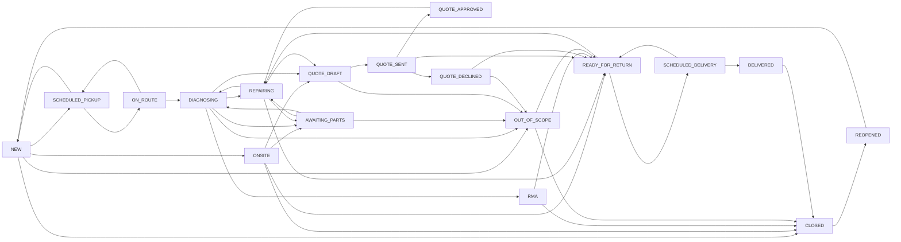

# ADR 0005 — Status taxonomy simplification (16 states + ON_HOLD overlay)

**Status:** Proposed (Stage 1). **Implementation gated on maintainer
sign-off.** No code, schema, or data migration in this branch.

**Date:** 2026-05-06.

**Author of proposal:** audit pass on
`claude/breakfix-triage-audit-ZDYuJ`.

**Decision authority:** the project maintainer (Aceospades95). Until
this ADR is approved, the legacy 26-state enum stays live; the only
in-flight change shipped alongside this proposal is the **interim**
fix to surface `IMPORTED` on the Kanban (so 248/252 seeded tickets
aren't invisible) — see §2#2 of the findings brief.

---

## Why this ADR exists

The QA pass against `https://triage.omnia-house.com` found three
related problems:

1. The Kanban shows "4 active across 22 columns" because `IMPORTED`
   isn't a column — but in a real seed 248 of 252 tickets are
   `IMPORTED`. The product surface lies about how much work exists.
2. Four `AWAITING_*` states (`AWAITING_PICKUP`, `AWAITING_PARTS`,
   `AWAITING_ONSITE`, `INVOICE_REQUIRED` is also "awaiting" in
   spirit) share visual treatment and are indistinguishable on a
   list. Field reps reportedly cannot scan a list and tell what is
   waiting on what.
3. 22 visible status columns overflow most screens; the Kanban
   board does not fit in one viewport even on a 27" monitor in
   2024-resolution windows.

These three things together mean the visible product surface is
operationally unreadable. We can't paper over this with theme
tweaks; it is a taxonomy problem.

---

## Proposed 16-state set

Five lanes plus an overlay flag.

### Lanes

- **INTAKE** — `NEW` (replaces `IMPORTED` + `TRIAGE`; auto-routed on
  creation). One state, not two — the legacy distinction between
  "imported" and "triage" is bookkeeping, not a workflow phase.
- **FIELD** — `SCHEDULED_PICKUP`, `ON_ROUTE`, `ONSITE` (replaces
  `AWAITING_PICKUP` / `PICKUP_SCHEDULED` / `AWAITING_ONSITE` /
  `ONSITE_IN_PROGRESS`). The "awaiting" prefix and the "in progress"
  suffix encoded the same thing: an operator hasn't started yet
  (`AWAITING_*`) vs. has started (`*_IN_PROGRESS`). That distinction
  is captured by job status (`SCHEDULED` / `EN_ROUTE` / `ARRIVED`)
  and doesn't need its own ticket states.
- **WORKSHOP** — `DIAGNOSING`, `AWAITING_PARTS`, `REPAIRING`,
  `READY_FOR_RETURN` (replaces `IN_WAREHOUSE` / `DIAGNOSIS` /
  `AWAITING_PARTS` / `PARTS_ORDERED` / `IN_REPAIR` /
  `REPAIR_COMPLETED`). `IN_WAREHOUSE` is collapsed into `DIAGNOSING`
  because "in warehouse but not yet diagnosed" is a 0-day
  bookkeeping state in practice. `PARTS_ORDERED` is collapsed into
  `AWAITING_PARTS` — the meaningful question is "are we waiting on
  parts?", not "have we placed the order yet?" (the latter is a
  property of the part, not the ticket).
- **QUOTE** — `QUOTE_DRAFT`, `QUOTE_SENT`, `QUOTE_APPROVED`,
  `QUOTE_DECLINED`. `QUOTE_REQUIRED` becomes the implicit "no quote
  yet" state (effectively `WORKSHOP/DIAGNOSING` with a flag, or a
  `Quote` row in `DRAFT`). `QUOTE_NO_RESPONSE` is folded into the
  auto-expiry of `QUOTE_SENT` — the existing sweep already handles
  this; the ticket simply re-enters the workshop or terminal lane
  via the existing transitions.
- **DELIVERY** — `SCHEDULED_DELIVERY`, `DELIVERED` (replaces
  `PENDING_DELIVERY` / `DELIVERY_SCHEDULED` / `RETURNED`). `RETURNED`
  is collapsed into `DELIVERED` — the legacy "ticket is returned but
  not yet closed" state was always 1-day plumbing for invoicing.
- **TERMINAL** — `CLOSED`, `OUT_OF_SCOPE`, `RMA`, `REOPENED`. `RMA`
  replaces `MANUFACTURER_RMA` (shorter; the long form is jargon).
  `REOPENED` stays because re-opens deserve their own state for
  reporting.

### Overlay

- **`ON_HOLD`** is removed as a state and modelled as an overlay
  flag on `Ticket`:
  - `onHold: boolean`
  - `onHoldReason: string?`
  - `onHoldUntil: timestamp?` (optional auto-resume)
  - `priorState: TicketState?` (so resuming returns to the right
    lane)

  Rationale: `ON_HOLD` is orthogonal to the workflow phase. A ticket
  on hold while in workshop is operationally different from a ticket
  on hold in delivery, and conflating them into a single state hides
  that information. The overlay also lets dashboards report "5
  workshop tickets on hold" without a join through `TicketEvent`.

### Final cardinality

- 16 states (1 + 3 + 4 + 4 + 2 + 4 — six terminal/quote rules trim
  the count), down from 26.
- 1 overlay flag (`ON_HOLD`) replaces 1 state.
- Net: 17 visible "things a ticket can be" on the surface, vs. 26
  today. Every Kanban column fits in a single viewport at typical
  laptop resolution.

---

## Mapping table — every legacy state → new state (or → flag)

| Legacy state            | New target               | Notes                                                                                              |
| ----------------------- | ------------------------ | -------------------------------------------------------------------------------------------------- |
| `IMPORTED`              | `NEW`                    | Auto-routed on creation. No bookkeeping pause.                                                     |
| `TRIAGE`                | `NEW`                    | Same lane. The "operator has eyeballed it" distinction is now `assignedUserId != null`.            |
| `AWAITING_PICKUP`       | `SCHEDULED_PICKUP`       | Renamed for clarity. `Job.status = SCHEDULED` carries the wait-vs-going-out distinction.            |
| `PICKUP_SCHEDULED`      | `SCHEDULED_PICKUP`       | Same target. The legacy split was vestigial.                                                       |
| `IN_WAREHOUSE`          | `DIAGNOSING`             | The 0-day "arrived but not on bench" gap is dropped.                                                |
| `DIAGNOSIS`             | `DIAGNOSING`             | Renamed (active voice).                                                                             |
| `AWAITING_PARTS`        | `AWAITING_PARTS`         | Kept.                                                                                               |
| `PARTS_ORDERED`         | `AWAITING_PARTS`         | "Have we ordered yet" is a property of the part, not the ticket.                                    |
| `IN_REPAIR`             | `REPAIRING`              | Renamed (active voice).                                                                             |
| `REPAIR_COMPLETED`      | `READY_FOR_RETURN`       | Renamed (operationally clearer).                                                                    |
| `AWAITING_ONSITE`       | `SCHEDULED_PICKUP`       | An onsite visit is a `Job` with `type = ONSITE_REPAIR`. The ticket lane is the same as a pickup.    |
| `ONSITE_IN_PROGRESS`    | `ONSITE`                 | Renamed (one word, active).                                                                         |
| `QUOTE_REQUIRED`        | `QUOTE_DRAFT`            | The DRAFT quote row is the carrier; ticket sits with quote_id != null.                              |
| `QUOTE_SENT`            | `QUOTE_SENT`             | Kept.                                                                                               |
| `QUOTE_APPROVED`        | `QUOTE_APPROVED`         | Kept.                                                                                               |
| `QUOTE_DECLINED`        | `QUOTE_DECLINED`         | Kept.                                                                                               |
| `QUOTE_NO_RESPONSE`     | `QUOTE_SENT` + auto-expire | The sweep already handles auto-expiry; the dedicated state was redundant.                          |
| `MANUFACTURER_RMA`      | `RMA`                    | Renamed (shorter).                                                                                  |
| `OUT_OF_SCOPE`          | `OUT_OF_SCOPE`           | Kept.                                                                                               |
| `PENDING_DELIVERY`      | `READY_FOR_RETURN`       | Same lane semantically.                                                                             |
| `DELIVERY_SCHEDULED`    | `SCHEDULED_DELIVERY`     | Renamed.                                                                                            |
| `RETURNED`              | `DELIVERED`              | Renamed (operationally clearer).                                                                    |
| `INVOICE_REQUIRED`      | `DELIVERED` + flag       | New flag `Ticket.invoiceRequired` is already in the schema; the dedicated state was redundant.       |
| `CLOSED`                | `CLOSED`                 | Kept.                                                                                               |
| `REOPENED`              | `REOPENED`               | Kept.                                                                                               |
| `ON_HOLD`               | overlay flag             | See "Overlay" above.                                                                                |

---

## Transition graph (Mermaid)

Note the back-edges from every "wait" state to its prior workshop or
field state (closing **B4** in the findings brief). A property test
on the new graph asserts:

- Every node is reachable from `NEW`.
- No unreachable terminal state.
- Every `AWAITING_*` / `SCHEDULED_*` / `READY_FOR_RETURN` has at
  least one back-edge into the lane it came from.

---

## Backwards compatibility

The legacy `TicketState` enum stays live for **one full release**
behind a feature flag (`ENABLE_NEW_TAXONOMY=false` by default). In
that window:

- The DB carries both columns: `state` (legacy) and `newState` (16-set).
- Read paths prefer `newState` when the flag is on, fall back to
  `state` otherwise.
- The API exposes a read-only `legacyStatus` field on every ticket
  payload. UI clients on the new flag never read `legacyStatus`;
  external consumers (the cutover-compare scripts, any script that
  reads the JSON export) keep working unchanged.
- Status pills, kanban columns, and admin Statuses page render the
  new set when the flag is on.

After one release with the flag on in prod, the legacy column is
dropped in a follow-up migration. That migration is its own ADR.

---

## Migration plan (idempotent, reversible)

`prisma/migrate-taxonomy.ts` (a separate script, **not** auto-run on
deploy):

1. **Dry-run mode (`--dry-run`)** prints counts per old→new mapping
   so the maintainer sees, for example, "248 IMPORTED → NEW; 0
   AWAITING_ONSITE → SCHEDULED_PICKUP; ...". No writes.
2. **Apply mode (`--apply`)** performs the backfill in batches of
   1000, logging an audit row per ticket
   (`action: "taxonomy-migrate", before: { state }, after:
   { newState }`). Idempotent: re-running on a partially-migrated DB
   is a no-op for already-migrated rows.
3. **Reverse mode (`--reverse`)** drops `newState` and any `priorState`
   on `ON_HOLD` overlay and restores the legacy enum from the audit
   trail. The `before` JSON written in step 2 is the source of truth
   for reverse — every reversed row writes its own audit entry
   (`action: "taxonomy-reverse"`).

Pre-prod gate:

- Run `--dry-run` against a freshly restored staging snapshot of
  prod.
- Diff the count summary into a PR comment for review.
- Apply on staging, run the e2e harness end-to-end, run
  `prisma/cutover-compare.ts` against the legacy sheet to confirm no
  parity regression.
- Only then schedule the prod window.

The migration runner is **not** invoked from a code PR. It is a
separate gated operation, documented in
`docs/runbooks/taxonomy-migration.md` (to be authored alongside Stage 2).

---

## SLA threshold migration

`DEFAULT_SLA_DAYS` in `src/lib/reports/sla.ts` and any per-state
overrides in `AppSetting:sla.thresholds` need new keys:

| New state             | Proposed default (days) | Derived from           |
| --------------------- | ----------------------- | ---------------------- |
| `NEW`                 | 1                       | min(IMPORTED:1, TRIAGE:2)  |
| `SCHEDULED_PICKUP`    | 3                       | max(AWAITING_PICKUP:3, AWAITING_ONSITE:3, PICKUP_SCHEDULED:1)  |
| `ON_ROUTE`            | 1                       | PICKUP_SCHEDULED:1     |
| `ONSITE`              | 1                       | ONSITE_IN_PROGRESS:1   |
| `DIAGNOSING`          | 3                       | DIAGNOSIS:3            |
| `AWAITING_PARTS`      | 14                      | max(AWAITING_PARTS:10, PARTS_ORDERED:14)  |
| `REPAIRING`           | 5                       | IN_REPAIR:5            |
| `READY_FOR_RETURN`    | 3                       | max(REPAIR_COMPLETED:2, PENDING_DELIVERY:3)  |
| `QUOTE_DRAFT`         | 2                       | QUOTE_REQUIRED:2       |
| `QUOTE_SENT`          | 7                       | QUOTE_SENT:7           |
| `QUOTE_APPROVED`      | 2                       | QUOTE_APPROVED:2       |
| `QUOTE_DECLINED`      | null                    | QUOTE_DECLINED:null    |
| `SCHEDULED_DELIVERY`  | 1                       | DELIVERY_SCHEDULED:1   |
| `DELIVERED`           | 7                       | INVOICE_REQUIRED:7 (since INVOICE_REQUIRED is now a flag) |
| `CLOSED`              | null                    | CLOSED:null            |
| `OUT_OF_SCOPE`        | 2                       | OUT_OF_SCOPE:2         |
| `RMA`                 | 30                      | MANUFACTURER_RMA:30    |
| `REOPENED`            | 1                       | REOPENED:1             |

Per-school SLA overrides (proposed in `docs/proposed-issues.md` Q9)
are migrated by the same script: every override row whose key is a
legacy state is re-keyed to the new state.

---

## What does NOT change

- `Quote`, `Job`, `Route`, `RouteStop`, `Part`, `ManufacturerRma`,
  and the audit / event-timeline tables are untouched.
- The `ImportPipeline`, `transitionTicket` engine API, and
  `writeAudit` interface are unchanged. Internals are updated to use
  the new enum.
- RBAC rules and permission overrides do not change.

---

## What this is NOT

- **Not** a redesign of admin Statuses, Permissions, or Settings —
  the findings report explicitly calls those pages out as the
  strongest in the product. Statuses gets one set of label updates
  to reflect the new enum and that is all.
- **Not** a feature add. No new product capability is introduced;
  this is purely a simplification.
- **Not** a unilateral move. Stage 2 only happens after the
  maintainer approves this ADR and the per-school SLA migration is
  reviewed.

---

## Risks

- **Data loss during the migration** if the script is buggy. Mitigated by
  the audit row per change and the `--reverse` mode.
- **Ops confusion during the flag-on period** — operators see
  ticket-list rows with state names that look unfamiliar. Mitigated
  by a one-page cheat sheet linked from the help menu and a
  pinned banner during the rollout window.
- **External integrations** that read raw `state` (the
  cutover-compare script; any future webhook consumers). Mitigated
  by `legacyStatus` exposed on the API for one full release.

---

## Open questions for the maintainer

1. Is the `ON_HOLD` overlay model (4 new columns on `Ticket`)
   acceptable, or do you want to model it as a separate `TicketHold`
   row keyed by ticket id?
2. Is folding `INVOICE_REQUIRED` into a flag on `Ticket` the right
   move, or should invoicing remain a state for billing-team
   ergonomics?
3. Should the new `RMA` state be reachable from `READY_FOR_RETURN`
   in addition to `DIAGNOSING`? (The legacy graph allowed it from
   only `DIAGNOSIS` and `ONSITE_IN_PROGRESS`.)
4. Confirm the rollout window for the feature flag — one release,
   one quarter, or until cutover-compare passes for N consecutive
   days?

These need answers before Stage 2 begins.
